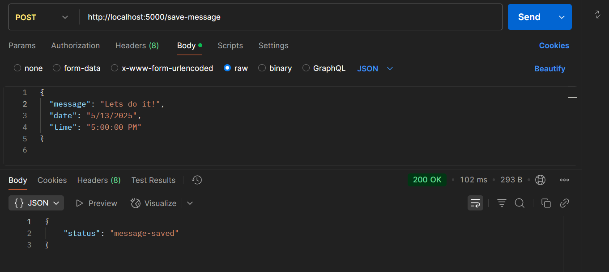
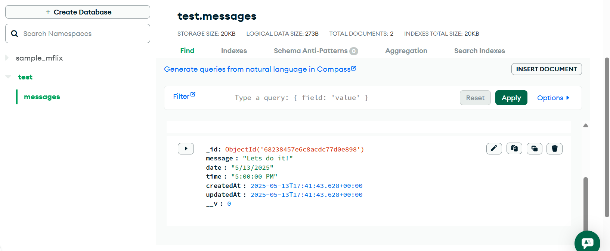

---


# Remind Me Later API

A simple Express backend that accepts a message with date and time and stores it in MongoDB Atlas.

---

## 🚀 Getting Started

### 1. Clone the repository
````markdown
git clone https://github.com/HarshaL181818/Symplique-assignment.git
cd Symplique-assignment
````
---

### 2. Create `.env` file in the root directory

Create a file named `.env` in the root of your project and add:

```
ATLAS_URI=your_mongodb_atlas_connection_string
```

---

### 3. Create a MongoDB Atlas cluster

* Go to [https://www.mongodb.com/cloud/atlas](https://www.mongodb.com/cloud/atlas)
* Create a free cluster
* Get your **connection string** and paste it in the `.env` file as shown above

---

### 4. Install dependencies

Make sure you're in the project directory, then run:

```bash
npm install express mongoose cors dotenv
```

---

## 🧪 Testing the API with Postman

1. Start the server:

```bash
node server.js
```

2. Open [Postman](https://www.postman.com/)

3. Create a `POST` request to:

```
http://localhost:5000/save-message
```

4. In the **Body** tab, select **raw**, choose **JSON**, and paste:

```json
{
  "message": "Hello backend!",
  "date": "5/13/2025",
  "time": "5:00:00 PM"
}
```

5. Hit **Send**.

You should get a response:

```json
{
  "status": "message-saved"
}
```

And the message will be stored in your MongoDB Atlas database.

---

## 📦 Tech Stack

* Node.js
* Express.js
* MongoDB Atlas
* Mongoose
* dotenv
* CORS

---


### 📬 Postman



Postman is used to test the POST `/save-message` endpoint by sending JSON data like messages, date, and time to the server.

---

### 🍃 MongoDB



MongoDB stores the incoming messages with their respective timestamps, allowing for scalable and flexible NoSQL data storage.

---

